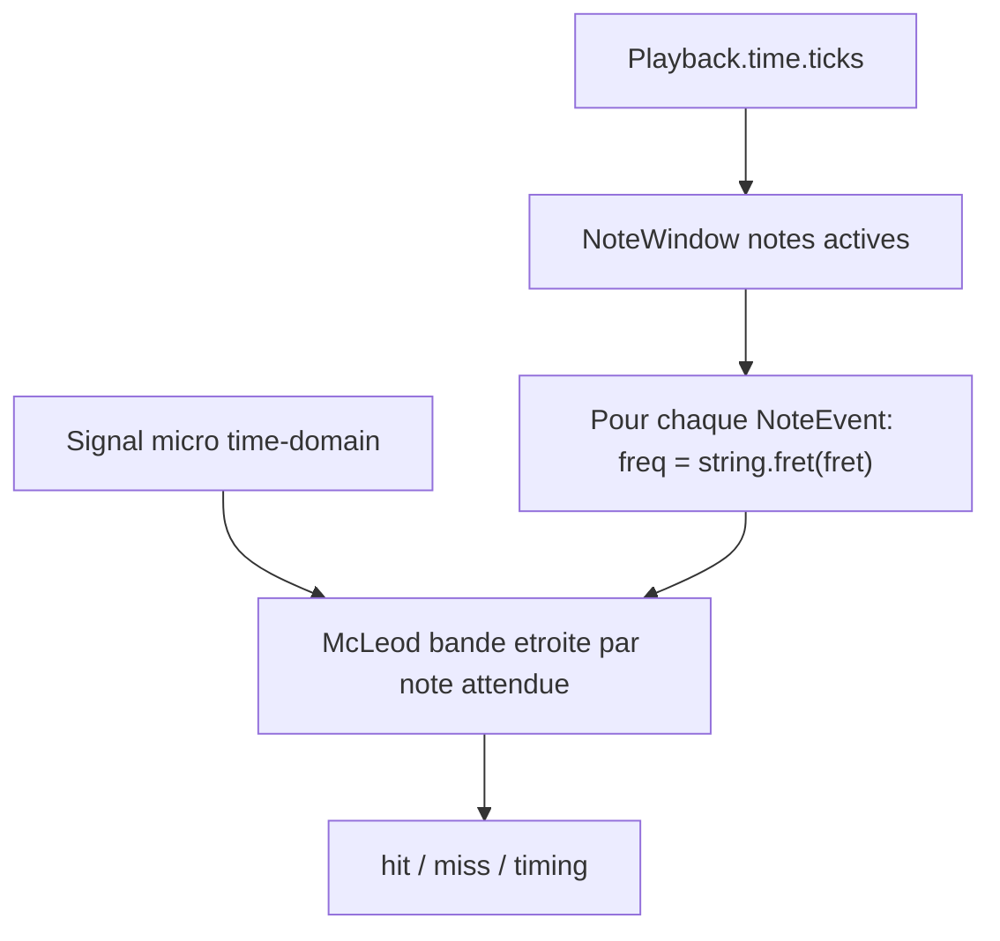

# Détection multi-notes au playback

Document de référence pour l'implémentation future du scoring pendant le playback.
À utiliser comme contexte dans une conversation Cursor pour brancher le détecteur.

## Contexte

L'application dispose déjà de :

- [`NoteEvent`](../src/sound/song/NoteEvent.ts) — corde, frette, timing, durée
- [`NoteWindow`](../src/core/NoteWindow.ts) — notes actives dans une fenêtre temporelle
- [`Playback`](../src/components/Playback.ts) — temps courant, liste de `PlaybackNote`
- [`McLeodPitchDetector`](../src/sound/pitch/McLeodPitchDetector.ts) — pitch monophonique fiable sur basse
- [`Tuner`](../src/components/Tuner.ts) — référence d'usage McLeod avec bande de fréquences resserrée

Le [`NoteDetector`](../src/resources/NoteDetector.ts) actuel (FFT aveugle via `getAllFrequencies()`) **ne doit pas être étendu**. Il ignore le score et performe mal sur la basse.

## Principe : détection score-driven

Le jeu connaît les notes attendues à l'instant T. La question n'est pas *« quelles notes entend-on ? »* mais *« l'utilisateur joue-t-il la note attendue ? »*.



### Pourquoi pas une détection polyphonique aveugle ?

| Approche | Problème sur basse |
|----------|-------------------|
| FFT peak-picking (`getAllFrequencies`) | Fondamentale faible vs harmoniques |
| McLeod global | Monophonique — une seule note à la fois |
| Détecteur polyphonique général (CREPE, pYIN…) | Complexe, latence, faux positifs avec backing track |

La basse est surtout monophonique ou avec peu de notes simultanées. Le score indique quelles notes chercher.

## Algorithme proposé

### Entrées (chaque frame, ~30–60 Hz)

1. `samples: Float32Array` — domaine temporel du tap micro partagé
2. `sampleRate: number`
3. `activeNotes: PlaybackNote[]` — depuis `NoteWindow` à `playback.time.ticks`
4. `ticks: number` — temps courant du playback

### Pour chaque note active

```ts
const targetNote = noteEvent.string.fret(noteEvent.fret)
const targetFrequency = targetNote.frequency

const semitoneWindow = 2 // ±2 demi-tons, à tuner
const ratio = 2 ** (semitoneWindow / 12)

const result = detector.findPitch(
    samples,
    sampleRate,
    targetFrequency / ratio,
    targetFrequency * ratio
)
```

### Validation hit

```ts
const CLARITY_THRESHOLD = 0.85 // même ordre de grandeur que Tuner
const TIMING_WINDOW_TICKS = ... // fenêtre avant/après noteEvent.time

const isOnTime = Math.abs(ticks - noteEvent.time) <= TIMING_WINDOW_TICKS
const isCorrectPitch = result !== null && result.clarity >= CLARITY_THRESHOLD

if (isOnTime && isCorrectPitch) {
    // hit
}
```

### Notes simultanées

Pour N notes actives en même temps : **N passes McLeod indépendantes**, chacune avec sa bande de fréquences autour de la note attendue. Pas de détection polyphonique générale.

Sur basse, N est typiquement 1–3.

## Composant cible : `PlaybackNoteDetector`

Emplacement suggéré : `app/src/components/PlaybackNoteDetector.ts` ou refactor de `NoteDetector`.

### Dépendances

| Ressource | Usage |
|-----------|-------|
| `LiveInstrument.rawOutput` | Source micro (tap partagé) |
| `Playback` | Temps courant, niveau, notes |
| `NoteWindow` | Notes visibles / actives |
| `McLeodPitchDetector` | Une instance réutilisée |
| `VolumeMeasurement` | Optionnel — ignorer la détection si volume < seuil |

### Cycle de vie

```
Playback.play()  → créer / activer PlaybackNoteDetector
Playback.pause() → pause (garder état ou reset selon UX)
Playback.destroy() → détruire le détecteur
```

### API suggérée

```ts
type DetectedHit = {
    noteId: string
    ticks: number
    frequency: number
    clarity: number
}

class PlaybackNoteDetector extends Component {
    get hits(): DetectedHit[]
    get activeDetections(): Map<string, { frequency: number, clarity: number }>
}
```

## Fenêtre temporelle (timing)

Utiliser `NoteWindow` pour limiter les notes à évaluer :

- `minTicks` / `maxTicks` autour du curseur playback
- Ne tester que les notes dont `noteEvent.time` est dans `[ticks - earlyWindow, ticks + lateWindow]`

Paramètres à calibrer en jeu :

- `earlyWindow` — tolérance pour jouer en avance
- `lateWindow` — tolérance pour jouer en retard
- `holdWindow` — durée minimale de maintien de la note

## Gating par volume

Avant McLeod, vérifier que le signal n'est pas du silence :

```ts
const volume = VolumeMeasurement.measure(samples, instrument.range)
if (volume < SILENCE_THRESHOLD)
    return // pas de détection
```

Évite les faux positifs quand l'utilisateur ne joue pas.

## Intégration avec le tap audio partagé

Voir le plan global : un seul `AnalyserNode` sur `LiveInstrument.rawOutput`.

```ts
const samples = analyser.getTimeDomainData()
const sampleRate = analyser.sampleRate
const deltaTime = ... // depuis le schedule

detector.process(samples, range, deltaTime) // volume
noteDetector.update(samples, sampleRate, activeNotes, ticks) // hits
```

## Ce qu'il ne faut pas faire

- Réutiliser `SoundAnalyserNode.getAllFrequencies()` pour le scoring
- Créer un analyser dédié par composant
- Chercher toutes les fréquences du spectre sans contexte score
- Calibrer le timing uniquement sur la détection pitch (combiner avec `noteEvent.time`)

## Fichiers existants à modifier (lors de l'implémentation)

1. Refactorer ou remplacer [`NoteDetector.ts`](../src/resources/NoteDetector.ts)
2. Brancher dans [`Playback.ts`](../src/components/Playback.ts)
3. Consommer [`NoteWindow`](../src/core/NoteWindow.ts) pour les notes actives
4. S'inspirer de [`Tuner.ts`](../src/components/Tuner.ts) pour McLeod + bande resserrée

## Extensions futures (hors scope initial)

- **Slides** (`NoteEvent.slide`) — élargir la bande de fréquences ou interpoler la cible dans le temps
- **Mode libre** — détection aveugle si pas de partition (nécessiterait une autre stratégie)
- **`AnalyserFilter.ts`** — filtre bandpass par corde si McLeod à bande étroite ne suffit pas avec le backing track fort

## Références internes

- Tuner avec `targetString` : bande ±4 demi-tons — [`Tuner._searchRange()`](../src/components/Tuner.ts)
- McLeod clarity threshold : `0.85` dans Tuner
- Fenêtre McLeod : buffer 8192 samples — [`McLeodPitchDetector.BUFFER_SIZE`](../src/sound/pitch/McLeodPitchDetector.ts)
